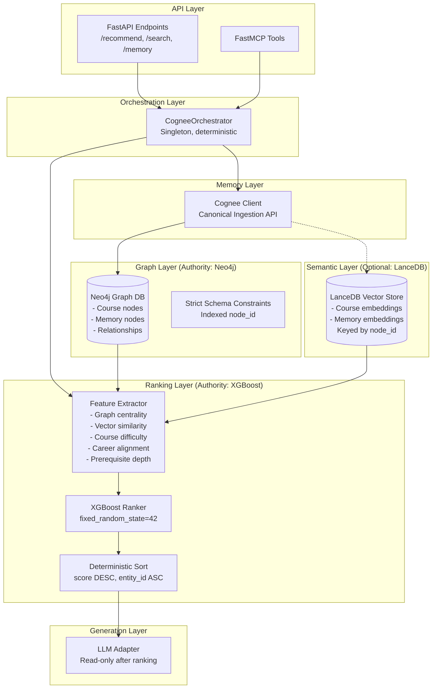
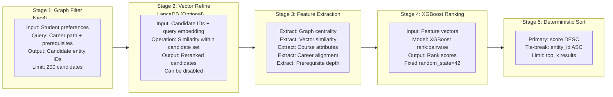
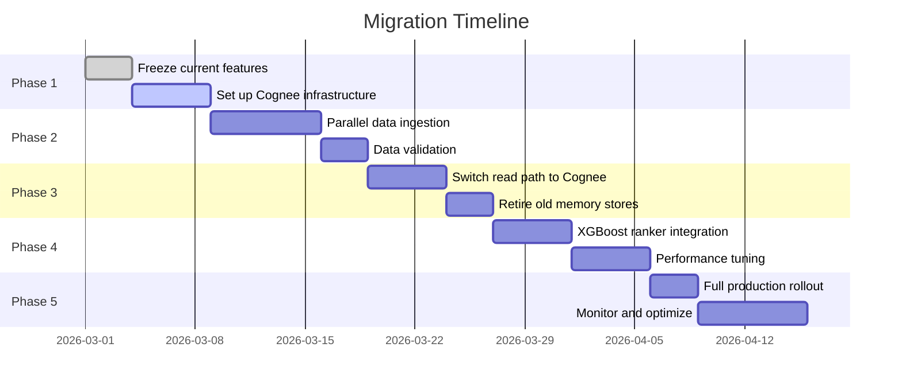

# Cognee Integration Architecture Design

**Phase:** 4 - Architecture Design  
**Date:** 2026-03-02  
**Status:** Design Document  
**Target:** Production-Ready Cognee Integration

---

## Executive Summary

This document defines the target architecture for integrating Cognee as the canonical memory ingestion layer while consolidating the AI agent's redundant storage systems into a deterministic, unified pipeline.

### Key Design Principles

1. **Single Source of Truth**: Cognee controls all memory/graph ingestion
2. **Deterministic Behavior**: Fixed random states, stable ordering, no side effects
3. **Unified Storage**: Neo4j for graphs, LanceDB for vectors (optional)
4. **Sole Ranking Authority**: XGBoost with fixed random_state
5. **Explicit Operations**: No hidden side effects or auto-generated relationships

---

## 1. Target Architecture Overview

### 1.1 High-Level System Diagram



### 1.2 Component Responsibilities

| Layer | Component | Responsibility | Authority |
|-------|-----------|----------------|-----------|
| API | FastAPI Endpoints | Request validation, response formatting | Interface only |
| API | FastMCP Tools | MCP tool registration, protocol compliance | Interface only |
| Orchestration | CogneeOrchestrator | Pipeline coordination, transaction boundaries | Singleton |
| Memory | Cognee Client | All data ingestion, chunking, embedding | Canonical source |
| Graph | Neo4j | Relationship storage, traversal queries | Single authority |
| Semantic | LanceDB | Optional vector similarity refinement | Secondary index |
| Ranking | XGBoost | Learning-to-rank, deterministic scoring | Sole authority |
| Generation | LLM Adapter | Final response generation | Read-only |

---

## 2. Layer-by-Layer Design

### 2.1 Memory Layer: Cognee Integration

#### 2.1.1 Cognee Configuration

```yaml
# cognee_config.yaml
cognee:
  # LLM Configuration
  llm_provider: "openai"
  llm_model: "gpt-4o-mini"
  llm_temperature: 0.0  # Deterministic
  
  # Graph Database
  graph_db_provider: "neo4j"
  graph_database_url: "${NEO4J_URI}"
  graph_database_username: "${NEO4J_USER}"
  graph_database_password: "${NEO4J_PASSWORD}"
  
  # Vector Database (optional, can be disabled)
  vector_db_provider: "lancedb"
  vector_db_url: "${LANCEDB_URI}"
  vector_embedding_model: "sentence-transformers/all-MiniLM-L6-v2"
  vector_embedding_dimension: 384
  
  # Processing
  chunk_size: 512
  chunk_overlap: 50
  incremental_loading: true
  
  # Security
  sanitize_exec_input: true  # Mitigate graph_model_utils.py exec() risk
  disable_auto_relationships: true  # No hidden side effects
```

#### 2.1.2 CustomMemoryNode → CogneeMemoryObject Mapping

| CustomMemoryNode (Legacy) | CogneeMemoryObject (Target) | Notes |
|---------------------------|----------------------------|-------|
| `id: str` | `id: UUID` | Auto-generated by Cognee |
| `text: str` | `content: str` | Renamed field |
| `embedding: List[float]` | `embedding: List[float]` | Stored in vector layer |
| `metadata: Dict` | `external_metadata: JSON` | Schema-flexible |
| `created_at: datetime` | `created_at: datetime` | Auto-managed |
| `content_hash: str` | `content_hash: str` | For deduplication |
| N/A | `node_set: List[str]` | Graph organization |

#### 2.1.3 Controlled MERGE Operations

**Before (Ad-hoc writes):**
```python
# OLD: Multiple components write directly to Neo4j
async def add_memory(text):
    # SQLite write
    await sqlite.execute("INSERT INTO memory_chunks ...")
    # Neo4j write
    await neo4j.run("CREATE (m:MemoryNode ...)")
    # Vector store write
    await lancedb.add(...)
```

**After (Cognee-controlled):**
```python
# NEW: All writes go through Cognee
async def add_memory(text, metadata=None):
    # Single Cognee call handles all storage layers
    await cognee.add(
        data=text,
        dataset_name="user_memories",
        user=current_user,
        external_metadata=metadata
    )
    # Cognee internally manages:
    # - Text chunking
    # - Embedding generation
    # - Neo4j graph node creation
    # - Optional LanceDB vector indexing
```

### 2.2 Graph Layer: Neo4j Integration

#### 2.2.1 Schema Constraints

```cypher
// Strict schema constraints for deterministic behavior

// Unique node identifiers
CREATE CONSTRAINT course_id_constraint IF NOT EXISTS
FOR (c:Course) REQUIRE c.id IS UNIQUE;

CREATE CONSTRAINT memory_node_id_constraint IF NOT EXISTS
FOR (m:MemoryNode) REQUIRE m.id IS UNIQUE;

CREATE CONSTRAINT department_code_constraint IF NOT EXISTS
FOR (d:Department) REQUIRE d.code IS UNIQUE;

// Required properties
CREATE CONSTRAINT course_name_exists IF NOT EXISTS
FOR (c:Course) REQUIRE c.name IS NOT NULL;

// Index for deterministic traversal
CREATE INDEX course_node_id_idx IF NOT EXISTS
FOR (c:Course) ON (c.id);

CREATE INDEX memory_node_id_idx IF NOT EXISTS
FOR (m:MemoryNode) ON (m.node_id);

CREATE INDEX memory_dataset_idx IF NOT EXISTS
FOR (m:MemoryNode) ON (m.dataset_name);
```

#### 2.2.2 Deterministic Traversal Queries

**Query Pattern: Course Discovery with Depth Limit**
```cypher
// Deterministic course discovery with strict depth limit
MATCH (seed:Course {id: $course_id})
CALL apoc.path.expandConfig(seed, {
    relationshipFilter: "PREREQUISITE>|PREREQUISITE_OF>|SIMILAR_TO>",
    minLevel: 1,
    maxLevel: 3,  // Hard cap at depth 3
    uniqueness: "NODE_GLOBAL",
    bfs: true     // Breadth-first for deterministic ordering
}) YIELD path
WITH last(nodes(path)) as related, path
WHERE related.id <> $course_id
RETURN 
    related.id as course_id,
    related.name as course_name,
    length(path) as graph_distance
ORDER BY graph_distance ASC, course_id ASC  // Deterministic tie-break
LIMIT $limit
```

**Query Pattern: Memory Context Retrieval**
```cypher
// Deterministic memory context with temporal awareness
MATCH (m:MemoryNode {node_id: $memory_id})
CALL apoc.path.expandConfig(m, {
    relationshipFilter: "RELATED_TO>|TEMPORALLY_FOLLOWS>|TEMPORALLY_PRECEDES>",
    minLevel: 1,
    maxLevel: 2,
    uniqueness: "NODE_GLOBAL",
    bfs: true
}) YIELD path
WITH last(nodes(path)) as related, relationships(path)[0] as rel, path
RETURN 
    related.node_id as memory_id,
    related.content as content,
    related.created_at as created_at,
    type(rel) as relationship_type,
    length(path) as distance
ORDER BY distance ASC, related.created_at DESC, memory_id ASC
LIMIT $context_size
```

#### 2.2.3 Transaction Boundaries

```python
class Neo4jTransactionManager:
    """Enforces strict transaction boundaries for deterministic operations."""
    
    async def execute_deterministic(self, query: str, params: Dict) -> List[Dict]:
        """
        Execute query within explicit transaction with ordering guarantees.
        """
        async with self.driver.session() as session:
            async with session.begin_transaction() as tx:
                # Set deterministic ordering for this transaction
                await tx.run("SET planner.doExperimentalPlanner=false")
                
                result = await tx.run(query, params)
                records = await result.data()
                
                # Commit only if deterministic
                await tx.commit()
                return records
    
    async def batch_merge_nodes(self, nodes: List[Dict]) -> None:
        """
        Batch MERGE operations for efficiency while maintaining determinism.
        Processes nodes in sorted order to ensure consistent merge behavior.
        """
        # Sort by ID for deterministic ordering
        sorted_nodes = sorted(nodes, key=lambda n: n['id'])
        
        async with self.driver.session() as session:
            async with session.begin_transaction() as tx:
                for node in sorted_nodes:
                    await tx.run("""
                        MERGE (n:MemoryNode {node_id: $id})
                        ON CREATE SET n = $props
                        ON MATCH SET n += $props
                    """, {'id': node['id'], 'props': node})
                await tx.commit()
```

### 2.3 Semantic Layer: LanceDB Integration (Optional)

#### 2.3.1 Single Embedding Index Design

**Schema: Unified Vector Store**
```python
# LanceDB table schema - single index keyed by node_id
VECTOR_SCHEMA = pa.schema([
    ("node_id", pa.string()),           # Neo4j node ID (primary key)
    ("node_type", pa.string()),         # "Course" | "MemoryNode" | "Document"
    ("embedding", pa.list_(pa.float32(), 384)),
    ("text_preview", pa.string()),      # First 200 chars for debugging
    ("dataset_name", pa.string()),      # For multi-tenant separation
    ("created_at", pa.timestamp('us')),
    ("content_hash", pa.string()),      # For deduplication
])

# Single table for all embeddings
# No duplication - Neo4j holds relationships, LanceDB holds vectors
```

#### 2.3.2 Optional Vector Refinement

```python
class VectorRefinementLayer:
    """
    Optional layer for vector similarity refinement in retrieval pipeline.
    Can be disabled for pure graph-based retrieval.
    """
    
    async def refine_candidates(
        self,
        candidate_ids: List[str],  # From Neo4j graph filter
        query_embedding: List[float],
        top_k: int = 50
    ) -> List[VectorRefinementResult]:
        """
        Refine graph-filtered candidates using vector similarity.
        Returns sorted results with similarity scores.
        """
        if not self.enabled:
            # Pass-through if disabled
            return [VectorRefinementResult(id=cid, score=1.0) for cid in candidate_ids]
        
        # Search within candidate set only (pre-filtered)
        results = await self.table.search(query_embedding)\
            .where(f"node_id IN {tuple(candidate_ids)}")\
            .limit(top_k)\
            .to_arrow()
        
        # Deterministic sort: similarity DESC, node_id ASC
        return sorted(
            [
                VectorRefinementResult(
                    id=row['node_id'],
                    score=row['_distance']  # LanceDB distance metric
                )
                for row in results.to_pylist()
            ],
            key=lambda r: (-r.score, r.node_id)  # Deterministic tie-break
        )
```

### 2.4 Ranking Layer: XGBoost Integration

#### 2.4.1 Fixed Random State Configuration

```python
@dataclass(frozen=True)
class DeterministicRankerConfig:
    """
    Immutable configuration for deterministic XGBoost ranking.
    All random elements fixed at initialization.
    """
    # Fixed random state - NEVER changes
    random_state: int = 42
    
    # Model hyperparameters (tuned, then frozen)
    objective: str = "rank:pairwise"
    n_estimators: int = 100
    max_depth: int = 6
    learning_rate: float = 0.1
    subsample: float = 0.8
    colsample_bytree: float = 0.8
    
    # Deterministic training
    deterministic: bool = True
    tree_method: str = "exact"  # Exact splits for reproducibility
    
    # Feature schema (stable, versioned)
    feature_schema_version: str = "v1.0"
    feature_names: Tuple[str, ...] = (
        "graph_centrality_score",      # PageRank/centrality from Neo4j
        "vector_similarity_score",     # From LanceDB or Cognee
        "course_difficulty",           # Math intensity normalized
        "career_alignment_score",      # Career path match
        "prerequisite_depth",          # Prerequisite chain length
        "temporal_recency",            # Time since last interaction
        "user_preference_match",       # Interest alignment
    )
```

#### 2.4.2 Stable Feature Extraction

```python
class DeterministicFeatureExtractor:
    """
    Extracts features in deterministic order with no randomness.
    """
    
    FEATURE_SCHEMA = [
        "graph_centrality_score",
        "vector_similarity_score", 
        "course_difficulty",
        "career_alignment_score",
        "prerequisite_depth",
        "temporal_recency",
        "user_preference_match",
    ]
    
    async def extract_features(
        self,
        candidate: CandidateEntity,
        context: RetrievalContext
    ) -> np.ndarray:
        """
        Extract feature vector in deterministic order.
        Returns numpy array with fixed schema.
        """
        features = np.zeros(len(self.FEATURE_SCHEMA), dtype=np.float32)
        
        # Feature 1: Graph Centrality (from Neo4j)
        features[0] = await self._get_centrality_score(candidate.id)
        
        # Feature 2: Vector Similarity (from LanceDB)
        features[1] = candidate.vector_similarity or 0.0
        
        # Feature 3: Course Difficulty
        features[2] = self._normalize_difficulty(candidate.math_intensity)
        
        # Feature 4: Career Alignment
        features[3] = self._calculate_career_match(
            candidate.career_paths,
            context.user_career_goal
        )
        
        # Feature 5: Prerequisite Depth
        features[4] = await self._get_prerequisite_depth(candidate.id)
        
        # Feature 6: Temporal Recency
        features[5] = self._calculate_recency(candidate.last_interaction)
        
        # Feature 7: User Preference Match
        features[6] = self._calculate_preference_match(
            candidate,
            context.user_preferences
        )
        
        return features
    
    def _normalize_difficulty(self, intensity: float) -> float:
        """Deterministic normalization to [0, 1] range."""
        return min(1.0, max(0.0, intensity))
```

#### 2.4.3 Deterministic Ranking Pipeline

```python
class DeterministicXGBoostRanker:
    """
    Sole ranking authority with deterministic output ordering.
    """
    
    def __init__(self, config: DeterministicRankerConfig):
        self.config = config
        self.model: Optional[xgb.XGBRanker] = None
        self._initialize_rng()
    
    def _initialize_rng(self):
        """Initialize isolated random number generator."""
        self.rng = np.random.default_rng(self.config.random_state)
        # XGBoost uses numpy global RNG - set it deterministically
        np.random.seed(self.config.random_state)
    
    async def rank(
        self,
        candidates: List[CandidateEntity],
        context: RetrievalContext
    ) -> List[RankedResult]:
        """
        Deterministic ranking with stable output ordering.
        """
        if not candidates:
            return []
        
        # Extract features (deterministic order)
        feature_matrix = await asyncio.gather(*[
            self.extractor.extract_features(c, context)
            for c in candidates
        ])
        X = np.vstack(feature_matrix)
        
        # Predict scores
        scores = self.model.predict(X)
        
        # Create ranked results without mutation
        results = [
            RankedResult(
                entity_id=c.id,
                entity=c,
                score=float(scores[i]),
                features=dict(zip(self.config.feature_names, X[i]))
            )
            for i, c in enumerate(candidates)
        ]
        
        # Deterministic sort: score DESC, entity_id ASC
        return sorted(
            results,
            key=lambda r: (-r.score, r.entity_id)
        )
```

---

## 3. Retrieval Pipeline Design

### 3.1 Deterministic 5-Stage Pipeline



### 3.2 Pipeline Stage Details

#### Stage 1: Graph Filter (Neo4j)

```python
class GraphFilterStage:
    """
    Stage 1: Filter candidates using Neo4j graph traversal.
    Single source of truth for relationship-based discovery.
    """
    
    async def execute(
        self,
        query: RetrievalQuery,
        max_candidates: int = 200
    ) -> List[str]:
        """
        Retrieve candidate entity IDs from graph.
        """
        cypher = """
        // Find courses by career path
        MATCH (c:Course)
        WHERE $career_goal IN c.career_paths
        
        // Include courses connected by prerequisites
        OPTIONAL MATCH path = (c)-[:PREREQUISITE|PREREQUISITE_OF*1..3]-(connected:Course)
        
        // Include similar courses
        OPTIONAL MATCH (c)-[:SIMILAR_TO]-(similar:Course)
        
        WITH collect(DISTINCT c) + collect(DISTINCT connected) + collect(DISTINCT similar) as all_courses
        UNWIND all_courses as course
        
        // Return unique IDs
        RETURN DISTINCT course.id as entity_id
        ORDER BY entity_id ASC  // Deterministic ordering
        LIMIT $limit
        """
        
        result = await self.neo4j.run(cypher, {
            'career_goal': query.career_goal,
            'limit': max_candidates
        })
        
        return [record['entity_id'] for record in result]
```

#### Stage 2: Vector Refinement (Optional LanceDB)

```python
class VectorRefinementStage:
    """
    Stage 2: Optional vector similarity refinement.
    Can be bypassed for pure graph-based retrieval.
    """
    
    async def execute(
        self,
        candidate_ids: List[str],
        query_embedding: List[float],
        top_k: int = 100,
        enabled: bool = True
    ) -> List[RefinedCandidate]:
        """
        Refine candidates using vector similarity.
        """
        if not enabled or not candidate_ids:
            # Pass-through with neutral scores
            return [
                RefinedCandidate(id=cid, vector_score=1.0)
                for cid in sorted(candidate_ids)  # Deterministic
            ]
        
        # Search within pre-filtered candidate set
        results = await self.vector_db.search(
            query_embedding=query_embedding,
            filter=f"node_id IN {tuple(candidate_ids)}",
            top_k=top_k
        )
        
        # Merge with candidates that didn't have vector matches
        matched_ids = {r.node_id for r in results}
        unmatched = [
            RefinedCandidate(id=cid, vector_score=0.0)
            for cid in candidate_ids
            if cid not in matched_ids
        ]
        
        all_results = results + unmatched
        
        # Deterministic sort: score DESC, id ASC
        return sorted(
            all_results,
            key=lambda r: (-r.vector_score, r.id)
        )[:top_k]
```

#### Stage 3-5: Feature Extraction → Ranking → Sorting

```python
class RankingPipeline:
    """
    Combined stages 3-5: Feature extraction, XGBoost ranking, deterministic sorting.
    """
    
    async def execute(
        self,
        refined_candidates: List[RefinedCandidate],
        context: RetrievalContext,
        top_k: int = 10
    ) -> List[FinalResult]:
        """
        Execute final ranking stages.
        """
        # Stage 3: Extract features
        candidates = await self._load_full_entities(refined_candidates)
        
        # Stage 4: XGBoost ranking
        ranked = await self.ranker.rank(candidates, context)
        
        # Stage 5: Already sorted by ranker (score DESC, id ASC)
        return ranked[:top_k]
```

---

## 4. Interface Definitions

### 4.1 CogneeOrchestrator Interface

```python
class CogneeOrchestrator(ABC):
    """
    Singleton orchestrator for deterministic Cognee operations.
    Entry point for all memory and retrieval operations.
    """
    
    @abstractmethod
    async def initialize(self) -> None:
        """Initialize all layers with deterministic configuration."""
        pass
    
    @abstractmethod
    async def ingest_memory(
        self,
        content: str,
        metadata: Optional[Dict[str, Any]] = None,
        dataset_name: str = "default"
    ) -> MemoryIngestionResult:
        """
        Ingest memory through Cognee (canonical ingestion).
        No hidden side effects - explicit operations only.
        """
        pass
    
    @abstractmethod
    async def create_relationship(
        self,
        source_id: str,
        target_id: str,
        relationship_type: str,
        properties: Optional[Dict[str, Any]] = None
    ) -> None:
        """
        Explicitly create graph relationship.
        Must be called by orchestrator, not as side effect.
        """
        pass
    
    @abstractmethod
    async def retrieve(
        self,
        query: RetrievalQuery,
        top_k: int = 10
    ) -> List[RetrievalResult]:
        """
        Execute full 5-stage retrieval pipeline.
        Deterministic output guaranteed.
        """
        pass
    
    @abstractmethod
    async def health_check(self) -> SystemHealth:
        """Check health of all layers."""
        pass
```

### 4.2 Neo4j Graph Interface

```python
class Neo4jGraphInterface(ABC):
    """
    Strict interface for Neo4j graph operations.
    All operations are deterministic with transaction boundaries.
    """
    
    @abstractmethod
    async def merge_node(
        self,
        node_type: str,
        node_id: str,
        properties: Dict[str, Any]
    ) -> None:
        """MERGE node with deterministic behavior."""
        pass
    
    @abstractmethod
    async def merge_relationship(
        self,
        source_id: str,
        target_id: str,
        rel_type: str,
        properties: Dict[str, Any]
    ) -> None:
        """MERGE relationship with type allowlist validation."""
        pass
    
    @abstractmethod
    async def traverse(
        self,
        start_id: str,
        relationship_types: List[str],
        max_depth: int = 3,
        limit: int = 100
    ) -> List[TraversalResult]:
        """
        Deterministic graph traversal.
        Results sorted by distance ASC, node_id ASC.
        """
        pass
    
    @abstractmethod
    async def batch_merge(
        self,
        nodes: List[Dict[str, Any]],
        relationships: List[Dict[str, Any]]
    ) -> None:
        """Batch merge within single transaction."""
        pass
```

### 4.3 Vector Store Interface (Optional)

```python
class VectorStoreInterface(ABC):
    """
    Optional vector refinement layer.
    Can be disabled for pure graph retrieval.
    """
    
    @abstractmethod
    async def index(
        self,
        node_id: str,
        embedding: List[float],
        metadata: Dict[str, Any]
    ) -> None:
        """Index embedding keyed by node_id."""
        pass
    
    @abstractmethod
    async def search(
        self,
        query_embedding: List[float],
        filter: Optional[str] = None,
        top_k: int = 50
    ) -> List[VectorSearchResult]:
        """Search vectors with optional pre-filter."""
        pass
    
    @abstractmethod
    async def delete(self, node_id: str) -> None:
        """Delete vector by node_id."""
        pass
```

### 4.4 Ranker Interface

```python
class RankerInterface(ABC):
    """
    Sole ranking authority interface.
    All implementations must be deterministic.
    """
    
    @abstractmethod
    async def rank(
        self,
        candidates: List[CandidateEntity],
        context: RetrievalContext
    ) -> List[RankedResult]:
        """
        Rank candidates deterministically.
        Output sorted by score DESC, entity_id ASC.
        """
        pass
    
    @property
    @abstractmethod
    def feature_schema(self) -> List[str]:
        """Stable feature schema for validation."""
        pass
    
    @property
    @abstractmethod
    def is_deterministic(self) -> bool:
        """Return True if ranker produces deterministic output."""
        pass
```

---

## 5. Migration Strategy

### 5.1 Migration Phases



### 5.2 Phase 1: Infrastructure Setup

**Tasks:**
1. Install Cognee v0.5.3 with Neo4j and LanceDB adapters
2. Create Cognee configuration file
3. Set up new Neo4j constraints and indexes
4. Create migration validation scripts

**Validation:**
```python
async def validate_infrastructure():
    """Verify all components are ready for migration."""
    assert await cognee.health_check()
    assert await neo4j.verify_constraints()
    assert await neo4j.verify_indexes()
    assert await lancedb.verify_schema()
```

### 5.3 Phase 2: Dual-Write Migration

**Strategy:**
```python
class DualWriteMigration:
    """
    Write to both old and new systems during transition.
    Read from old system, validate against new.
    """
    
    async def add_memory(self, text, metadata):
        # Write to old system (current)
        old_result = await self.old_memory.add(text, metadata)
        
        # Write to new system (Cognee)
        try:
            new_result = await self.cognee.add(text, metadata)
            
            # Validate consistency
            await self.validator.compare(old_result, new_result)
        except Exception as e:
            # Log but don't fail - old system is still primary
            logger.warning(f"Cognee write failed: {e}")
        
        return old_result
```

### 5.4 Phase 3: Read Path Migration

**Switch Strategy:**
```python
class FeatureFlagRouter:
    """Route traffic based on feature flags."""
    
    async def retrieve(self, query):
        if self.config.USE_COGNEE_RETRIEVAL:
            return await self.cognee_orchestrator.retrieve(query)
        else:
            return await self.old_recommender.recommend(query)
```

### 5.5 Phase 4: XGBoost Ranker Integration

**Migration Steps:**
1. Train new XGBoost model with fixed random_state=42
2. Validate deterministic output on test dataset
3. A/B test against old ranking system
4. Switch to new ranker when performance validated

### 5.6 Phase 5: Cleanup

**Retirement Checklist:**
- [ ] Remove old memory.py, memory_graph.py
- [ ] Remove redundant vector stores
- [ ] Archive old ranking implementations
- [ ] Update documentation
- [ ] Monitor for 7 days post-migration

---

## 6. Risk Mitigation

### 6.1 Component Risk Matrix

| Component | Risk Level | Risk Description | Mitigation Strategy |
|-----------|------------|------------------|---------------------|
| Cognee Ingestion | HIGH | `exec()` vulnerability in graph model generation | Input sanitization, sandboxed execution |
| Cognee Ingestion | MEDIUM | Dependency version conflicts (asyncpg, fastapi) | Pin versions, test compatibility |
| Neo4j Graph | MEDIUM | Cypher injection via relationship type concatenation | Use parameterized queries with type allowlist |
| Neo4j Graph | LOW | Transaction timeout on large batches | Batch size limits, retry logic |
| LanceDB Vector | LOW | Optional layer - can be disabled | Graceful degradation to graph-only |
| XGBoost Ranker | MEDIUM | Training-serving skew | Feature schema validation, model versioning |
| XGBoost Ranker | LOW | Non-deterministic output | Fixed random_state, isolated RNG |

### 6.2 Detailed Mitigation Strategies

#### 6.2.1 Cognee `exec()` Vulnerability

**Risk:** `cognee/shared/graph_model_utils.py:46` uses `exec()` on potentially untrusted input.

**Mitigation:**
```python
class SanitizedCogneeClient:
    """Wrapper that sanitizes inputs before Cognee processing."""
    
    # Allowlist of safe characters for metadata
    SAFE_METADATA_PATTERN = re.compile(r'^[\w\s\-\.,;:()\[\]{}@"\'\\/]+$')
    
    async def add(self, data, metadata=None, **kwargs):
        # Validate metadata before passing to Cognee
        if metadata:
            sanitized = self._sanitize_metadata(metadata)
        
        # Validate data content
        if isinstance(data, str):
            data = self._sanitize_text(data)
        
        return await self.cognee.add(data, metadata=sanitized, **kwargs)
    
    def _sanitize_metadata(self, metadata: Dict) -> Dict:
        """Remove potentially dangerous characters."""
        sanitized = {}
        for key, value in metadata.items():
            if not self.SAFE_METADATA_PATTERN.match(str(key)):
                raise ValueError(f"Invalid metadata key: {key}")
            sanitized[key] = value
        return sanitized
```

#### 6.2.2 Cypher Injection Prevention

**Mitigation:**
```python
class SafeNeo4jInterface:
    """Neo4j interface with relationship type allowlist."""
    
    ALLOWED_RELATIONSHIPS = {
        "PREREQUISITE",
        "PREREQUISITE_OF",
        "SIMILAR_TO",
        "RELATED_TO",
        "TEMPORALLY_FOLLOWS",
        "TEMPORALLY_PRECEDES",
        "BELONGS_TO",
        "OFFERS",
    }
    
    async def merge_relationship(
        self,
        source_id: str,
        target_id: str,
        rel_type: str,
        properties: Dict
    ) -> None:
        # Validate relationship type against allowlist
        if rel_type not in self.ALLOWED_RELATIONSHIPS:
            raise ValueError(f"Relationship type '{rel_type}' not in allowlist")
        
        # Use parameterized query - no string concatenation
        query = """
        MATCH (source {id: $source_id})
        MATCH (target {id: $target_id})
        MERGE (source)-[r:__REL_TYPE__]->(target)
        ON CREATE SET r = $props
        ON MATCH SET r += $props
        """.replace("__REL_TYPE__", rel_type)  # Safe - validated above
        
        await self.run(query, {
            'source_id': source_id,
            'target_id': target_id,
            'props': properties
        })
```

#### 6.2.3 XGBoost Determinism Validation

**Mitigation:**
```python
class DeterminismValidator:
    """Validate that XGBoost ranker produces deterministic output."""
    
    async def validate(self, ranker: RankerInterface, test_cases: List) -> bool:
        """Run ranker multiple times and verify identical output."""
        for test_case in test_cases:
            # Run 5 times
            results = [
                await ranker.rank(test_case.candidates, test_case.context)
                for _ in range(5)
            ]
            
            # All results should be identical
            first = results[0]
            for i, result in enumerate(results[1:], 1):
                if not self._results_equal(first, result):
                    logger.error(f"Non-deterministic output on run {i}")
                    return False
        
        return True
    
    def _results_equal(self, a: List[RankedResult], b: List[RankedResult]) -> bool:
        if len(a) != len(b):
            return False
        for r1, r2 in zip(a, b):
            if r1.entity_id != r2.entity_id:
                return False
            if abs(r1.score - r2.score) > 1e-6:
                return False
        return True
```

#### 6.2.4 Graceful Degradation

**Mitigation:**
```python
class ResilientRetrievalPipeline:
    """Pipeline with graceful degradation for component failures."""
    
    async def retrieve(self, query: RetrievalQuery) -> List[RetrievalResult]:
        try:
            # Try full pipeline
            return await self._full_pipeline(query)
        except LanceDBException:
            # Degrade to graph-only retrieval
            logger.warning("LanceDB unavailable, using graph-only retrieval")
            return await self._graph_only_pipeline(query)
        except Neo4jException:
            # Degrade to vector-only retrieval
            logger.warning("Neo4j unavailable, using vector-only retrieval")
            return await self._vector_only_pipeline(query)
        except Exception as e:
            # Final fallback: rule-based
            logger.error(f"All retrieval methods failed: {e}")
            return await self._fallback_retrieval(query)
```

---

## 7. Testing Strategy

### 7.1 Determinism Tests

```python
class TestDeterminism:
    """Verify deterministic behavior across all components."""
    
    async def test_ranking_determinism(self):
        """XGBoost must produce identical output for same input."""
        candidates = generate_test_candidates(seed=42)
        context = generate_test_context(seed=42)
        
        results_1 = await ranker.rank(candidates, context)
        results_2 = await ranker.rank(candidates, context)
        
        assert results_1 == results_2
    
    async def test_graph_traversal_determinism(self):
        """Graph queries must return same order every time."""
        query = "MATCH (c:Course) RETURN c.id ORDER BY c.id"
        
        results_1 = await neo4j.run(query)
        results_2 = await neo4j.run(query)
        
        assert results_1 == results_2
```

### 7.2 Integration Tests

```python
class TestIntegration:
    """End-to-end integration tests."""
    
    async def test_full_retrieval_pipeline(self):
        """Test complete 5-stage pipeline."""
        # Setup test data
        await seed_test_data()
        
        # Execute pipeline
        query = RetrievalQuery(career_goal="software_engineer")
        results = await orchestrator.retrieve(query, top_k=10)
        
        # Verify results
        assert len(results) <= 10
        assert all(r.score >= 0 for r in results)
        
        # Verify deterministic ordering
        scores = [r.score for r in results]
        ids = [r.entity_id for r in results]
        assert scores == sorted(scores, reverse=True)
```

---

## 8. Appendix

### 8.1 Glossary

| Term | Definition |
|------|------------|
| Cognee | Canonical memory ingestion library |
| Deterministic | Producing identical output for identical input |
| MERGE | Cypher operation to create or update nodes |
| Random State | Seed value for reproducible random numbers |
| Side Effect | Unexpected operation triggered by primary action |
| Tie-Break | Secondary sort key for equal primary values |

### 8.2 References

- [Cognee Analysis](cognee_analysis.md) - Detailed Cognee capability analysis
- [Architecture Audit](architecture_audit.md) - Current system issues
- [Current Architecture](current_architecture.md) - Baseline system documentation
- TOML Specification: `ai_agent_full_stack.toml`

### 8.3 Decision Log

| Date | Decision | Rationale |
|------|----------|-----------|
| 2026-03-02 | Use Cognee as canonical ingestion | Eliminates redundant storage, unified API |
| 2026-03-02 | Fixed random_state=42 | Ensures reproducible ranking |
| 2026-03-02 | Neo4j as single graph authority | Eliminates graph consistency issues |
| 2026-03-02 | LanceDB as optional layer | Allows graceful degradation |
| 2026-03-02 | Explicit relationship creation | Removes hidden side effects |
