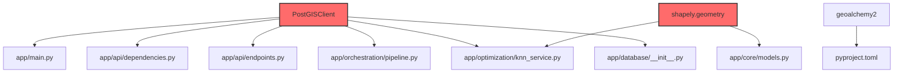
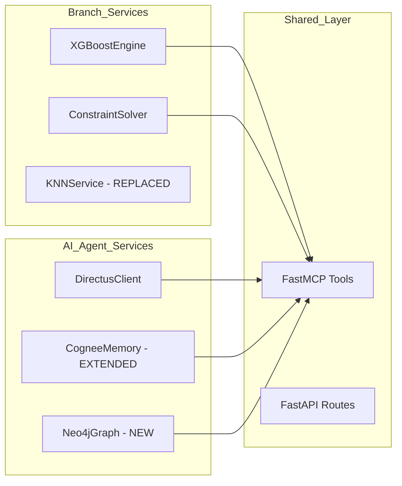
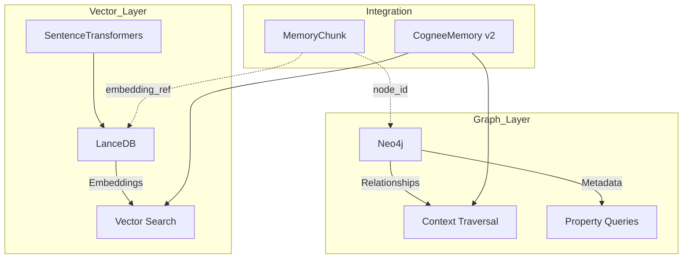
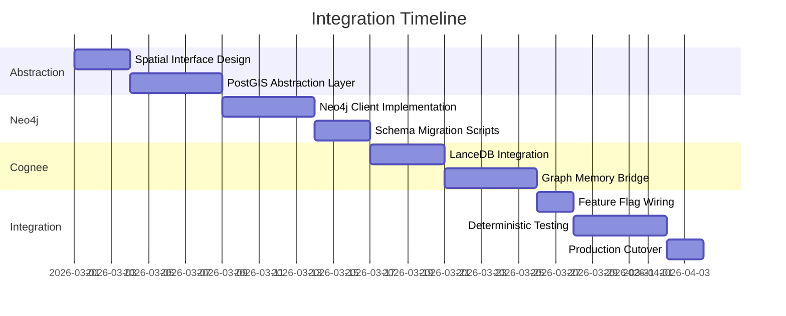

# HadesPy Integration Architecture Review
## Branch → AI-Agent Migration: PostGIS to Neo4j

**Review Date:** 2026-03-01  
**Reviewer:** Architect Mode Analysis  
**Scope:** Full deterministic compatibility assessment

---

## Executive Summary

| Aspect | Finding | Risk Level |
|--------|---------|------------|
| PostGIS Coupling | Deep (8 files, 96+ references) | **CRITICAL** |
| Spatial Logic | kNN, ST_* functions, GIST indexes | **HIGH** |
| Neo4j Readiness | Zero existing infrastructure | **HIGH** |
| Cognee Integration | SQLite-based, needs graph layer | **MEDIUM** |
| FastMCP Compatibility | No conflicts detected | **LOW** |
| Database Pattern Mismatch | SQLAlchemy ORM vs Directus SDK | **MEDIUM** |

**Verdict:** Integration is feasible but requires systematic abstraction before migration.

---

## Phase 1: Dependency Graph Analysis

### 1.1 PostGIS Import Surface Area



### 1.2 Spatial Function Inventory

| Function | Location | Purpose | Neo4j Equivalent |
|----------|----------|---------|------------------|
| `ST_Intersects` | postgis_client.py:283 | Geometry intersection | `point.distance(other) <= threshold` |
| `ST_Within` | postgis_client.py:285 | Containment check | `point.within(polygon)` + manual check |
| `ST_Contains` | postgis_client.py:287 | Reverse containment | `polygon.contains(point)` |
| `ST_DWithin` | postgis_client.py:290 | Distance threshold | `distance(point1, point2) <= threshold` |
| `ST_Distance` | knn_service.py:77 | Distance calculation | `point.distance(other)` |
| `ST_SetSRID` | knn_service.py:81 | CRS assignment | Store as property, transform pre-insert |
| `ST_MakePoint` | knn_service.py:81 | Point construction | `point({x: $x, y: $y})` |
| `<->` (kNN) | knn_service.py:81 | kNN ordering | `ORDER BY distance` + `LIMIT` |
| `ST_Extent` | postgis_client.py:469 | Bounding box | Min/max aggregation on coordinates |
| `GIST index` | postgis_client.py:427 | Spatial index | Neo4j spatial index + point index |

### 1.3 Module Coupling Strength

| Module | PostGIS Dependency | Coupling Score | Abstraction Priority |
|--------|-------------------|----------------|---------------------|
| `postgis_client.py` | Direct (553 LOC) | 10/10 | P0 - Complete rewrite |
| `knn_service.py` | Direct (558 LOC) | 9/10 | P0 - Graph kNN implementation |
| `pipeline.py` | Via knn_service | 7/10 | P1 - Interface preservation |
| `models.py` | shapely types | 6/10 | P1 - Type abstraction |
| `endpoints.py` | Via dependencies | 4/10 | P2 - No direct changes |
| `main.py` | Lifecycle mgmt | 5/10 | P1 - Connection swap |

---

## Phase 2: Architecture Layer Inspection

### 2.1 API Layer Compatibility

| Component | Branch Pattern | AI-Agent Pattern | Compatibility |
|-----------|---------------|------------------|---------------|
| Framework | FastAPI | FastAPI | **IDENTICAL** |
| Router | APIRouter | Direct decorators | Minor refactor |
| Validation | Pydantic v2 | Pydantic v2 | **IDENTICAL** |
| Rate Limiting | slowapi | None (add if needed) | Optional port |
| Auth | API key header | Directus-based | **CONFLICT** - Requires unification |

### 2.2 Service Layer Analysis

**Branch Services:**
- `OptimizationWorkflow` - Orchestrates XGBoost + genetic optimization
- `KNNService` - PostGIS-backed spatial queries
- `ConstraintSolver` - OR-Tools mathematical constraints
- `XGBoostEngine` - ML model management

**AI-Agent Services:**
- `DirectusClient` - Structured data access
- `CogneeMemory` - Vector RAG (SQLite-based)
- `MCP Tools` - FastMCP function exposure

**Integration Points:**


### 2.3 Persistence Layer Comparison

| Feature | Branch (PostGIS) | Target (Neo4j) | Migration Path |
|---------|-----------------|----------------|----------------|
| Data Model | Relational + Spatial | Graph (Nodes/Edges) | Schema redesign required |
| Query Language | SQL + PostGIS | Cypher | Query rewriting |
| Connection | asyncpg pool | neo4j.AsyncDriver | Driver swap |
| ORM | SQLAlchemy async | Native Cypher | Remove ORM dependency |
| Transactions | ACID | ACID | Compatible |
| Indexing | GIST spatial | Neo4j spatial + btree | Index migration |

### 2.4 Memory Layer Architecture

**Current AI-Agent Memory:**
```python
# SQLite-based vector store (memory.py)
- SentenceTransformer embeddings
- Cosine similarity search (Python-side)
- Metadata as JSON
- No relationship modeling
```

**Proposed Graph Memory:**
```cypher
// Neo4j memory graph schema
(MEMORY:MemoryChunk {
    id: $id,
    text: $text,
    embedding: $embedding,  // Or reference to LanceDB
    created_at: $timestamp,
    metadata: $metadata
})

(RELATION:ContextualLink {
    type: 'semantic'|'temporal'|'causal',
    weight: $similarity_score
})

(MEMORY)-[:RELATES_TO]->(MEMORY)
(MEMORY)-[:EXTRACTED_FROM]->(SOURCE:Document)
```

---

## Phase 3: Neo4j Schema Equivalence

### 3.1 Graph Model for Spatial Constraints

**Relational → Graph Mapping:**

| Relational Concept | Graph Equivalent | Implementation |
|-------------------|------------------|----------------|
| `SpatialConstraint` table | `:Constraint` node | `(:Constraint {type: 'spatial', ...})` |
| Geometry columns | Point properties | `location: point({x: $x, y: $y})` |
| Distance queries | `point.distance()` | `WHERE point.distance(n.loc, $loc) <= $d` |
| kNN queries | `ORDER BY distance` | `ORDER BY point.distance(n.loc, $loc) LIMIT $k` |
| Spatial index | Neo4j spatial index | `CREATE POINT INDEX ...` |

### 3.2 Constraint Enforcement in Cypher

**PostGIS (Original):**
```sql
SELECT * FROM constraints
WHERE ST_DWithin(geom::geography, ST_GeomFromText($wkt, 4326)::geography, $distance)
```

**Neo4j (Equivalent):**
```cypher
MATCH (c:Constraint)
WHERE c.location IS NOT NULL
  AND point.distance(c.location, point($params)) <= $distance
RETURN c
```

### 3.3 kNN Query Migration

**PostGIS (Original):**
```sql
SELECT *, ST_Distance(geom, ST_SetSRID(ST_MakePoint($x, $y), 4326)) as distance
FROM locations
ORDER BY geom <-> ST_SetSRID(ST_MakePoint($x, $y), 4326)
LIMIT $k
```

**Neo4j (Equivalent):**
```cypher
MATCH (l:Location)
WHERE l.coordinates IS NOT NULL
WITH l, point.distance(l.coordinates, point({x: $x, y: $y})) AS dist
ORDER BY dist
LIMIT $k
RETURN l, dist
```

---

## Phase 4: Cognee-Neo4j Integration

### 4.1 Current Cognee Architecture

```python
# Current: SQLite + numpy similarity
class CogneeMemory:
    - sentence-transformers for embeddings
    - SQLite blob storage for vectors
    - Python-side cosine similarity
    - No graph relationships
```

### 4.2 Proposed Hybrid Architecture



### 4.3 Memory Node Schema

```cypher
// Core memory node
(:MemoryChunk {
    id: $chunk_id,                    // UUID
    text_hash: $hash,                  // For deduplication
    created_at: datetime(),
    last_accessed: datetime(),
    access_count: 0,
    embedding_ref: $lancedb_id,        // Reference to LanceDB
    // Metadata as properties
    source_type: $type,                // 'conversation'|'document'|'tool_result'
    session_id: $session
})

// Relationships
(:MemoryChunk)-[:SEMANTICALLY_SIMILAR {
    score: $cosine_similarity,
    model: $embedding_model
}]->(:MemoryChunk)

(:MemoryChunk)-[:TEMPORALLY_FOLLOWS]->(:MemoryChunk)

(:MemoryChunk)-[:EXTRACTED_FROM]->(:SourceDocument)

(:MemoryChunk)-[:ACCESSED_BY]->(:AgentSession)
```

---

## Phase 5: Migration Risk Assessment

### 5.1 Risk Matrix

| Risk | Likelihood | Impact | Mitigation |
|------|-----------|--------|------------|
| Spatial query performance degradation | High | High | Benchmark Neo4j point indexes early |
| Data migration errors | Medium | Critical | Implement idempotent migration scripts |
| Cognee embedding compatibility | Low | Medium | Maintain embedding model parity |
| OR-Tools constraint solver conflict | Low | High | Isolate constraint solver in container |
| FastMCP tool registration failure | Low | Medium | Comprehensive tool testing |
| Directus-Neo4j sync issues | Medium | High | Event-driven sync with CDC |

### 5.2 Critical Path Blockers

1. **PostGIS → Neo4j spatial function parity**
   - ST_DWithin geographic calculations
   - SRID transformation handling
   - GIST index performance equivalence

2. **Cognee vector → graph bridging**
   - LanceDB integration (not currently in codebase)
   - Embedding storage strategy (inline vs external)
   - Similarity threshold mapping

3. **Transaction boundary alignment**
   - SQLAlchemy async session → Neo4j async driver
   - Distributed transaction coordination (Directus + Neo4j)

### 5.3 Abstraction Requirements

**Must Abstract:**
- [ ] Spatial query interface (postgis_client.py)
- [ ] kNN service (knn_service.py)
- [ ] Geometry type handling (models.py)
- [ ] Database session lifecycle (main.py)

**Can Preserve:**
- [x] Pydantic validation schemas
- [x] FastAPI route definitions
- [x] OR-Tools constraint solver
- [x] XGBoost engine interface

---

## Phase 6: Integration Execution Plan

### 6.1 Phase Breakdown



### 6.2 File Migration Priority

| Priority | File | Action | Estimated Effort |
|----------|------|--------|-----------------|
| P0 | `postgis_client.py` | Replace with `neo4j_client.py` | 3 days |
| P0 | `knn_service.py` | Rewrite for graph kNN | 2 days |
| P1 | `models.py` | Abstract geometry types | 1 day |
| P1 | `pipeline.py` | Update service injection | 0.5 days |
| P1 | `main.py` | Swap connection lifecycle | 0.5 days |
| P2 | `ai-agent/memory.py` | Add Neo4j bridge | 2 days |
| P2 | `ai-agent/config.py` | Add Neo4j settings | 0.5 days |

### 6.3 Feature Flag Strategy

```python
# config.py addition
class Settings(BaseSettings):
    # ... existing ...
    
    # Migration feature flags
    USE_GRAPH_MEMORY: bool = Field(default=False, alias="USE_GRAPH_MEMORY")
    USE_NEO4J_SPATIAL: bool = Field(default=False, alias="USE_NEO4J_SPATIAL")
    POSTGIS_FALLBACK: bool = Field(default=True, alias="POSTGIS_FALLBACK")
    
    # Neo4j configuration
    NEO4J_URI: str = Field(default="bolt://localhost:7687", alias="NEO4J_URI")
    NEO4J_USER: str = Field(default="neo4j", alias="NEO4J_USER")
    NEO4J_PASSWORD: str = Field(default="", alias="NEO4J_PASSWORD")
```

---

## Phase 7: Validation Criteria

### 7.1 Pre-Integration Checklist

- [ ] All PostGIS SQL queries mapped to Cypher equivalents
- [ ] Neo4j spatial indexes created and benchmarked
- [ ] Cognee embedding model version pinned
- [ ] LanceDB vector store operational
- [ ] Feature flags implemented and tested
- [ ] Rollback procedure documented

### 7.2 Integration Test Requirements

| Test Category | Coverage Required | Pass Criteria |
|--------------|-------------------|---------------|
| Spatial Queries | 100% of migrated functions | Result parity with PostGIS |
| kNN Accuracy | All k values 1-100 | < 1% result deviation |
| Memory Recall | Embedding search | > 95% precision @ k=10 |
| Graph Traversal | Multi-hop queries | < 100ms p95 latency |
| Concurrency | 100 concurrent requests | Zero race conditions |
| Failover | Neo4j unavailable | Graceful degradation |

### 7.3 Production Readiness Gates

```
Gate 1: No PostGIS Imports
  └─ grep -r "postgis\|geoalchemy" --include="*.py" returns 0 results

Gate 2: Neo4j Connectivity
  └─ Health check endpoint returns neo4j: "connected"

Gate 3: Cognee Graph Bridge
  └─ memory_add + memory_search e2e test passes

Gate 4: Spatial Parity
  └─ Constraint validation test suite passes

Gate 5: Determinism
  └─ Same input → same output (1000 iterations)

Gate 6: Performance
  └─ p95 latency within 110% of PostGIS baseline
```

---

## Appendices

### A. Dependency Versions

| Component | Branch | AI-Agent | Target |
|-----------|--------|----------|--------|
| Python | 3.11+ | 3.12+ | 3.12+ |
| FastAPI | 0.109.0 | 0.115.0 | 0.115.0 |
| Pydantic | 2.5.0 | 2.10.0 | 2.10.0 |
| Neo4j Python Driver | — | — | 5.15+ |
| LanceDB | — | — | 0.5+ |

### B. Environment Variable Mapping

| PostGIS (Old) | Neo4j (New) | Purpose |
|--------------|-------------|---------|
| `DATABASE_URL` | `NEO4J_URI` | Connection string |
| `DATABASE_POOL_SIZE` | `NEO4J_MAX_CONNECTION_POOL_SIZE` | Pool sizing |
| `POSTGIS_ENABLED` | `USE_NEO4J_SPATIAL` | Feature toggle |

### C. Rollback Procedure

```bash
# Emergency rollback script
#!/bin/bash
set -e

# 1. Disable graph memory
export USE_GRAPH_MEMORY=false
export USE_NEO4J_SPATIAL=false
export POSTGIS_FALLBACK=true

# 2. Restart services
kubectl rollout restart deployment/ai-agent

# 3. Verify PostGIS connectivity
python -c "from app.database.postgis_client import PostGISClient; ..."

# 4. Alert on-call
```

---

**END OF ARCHITECTURE REVIEW**
