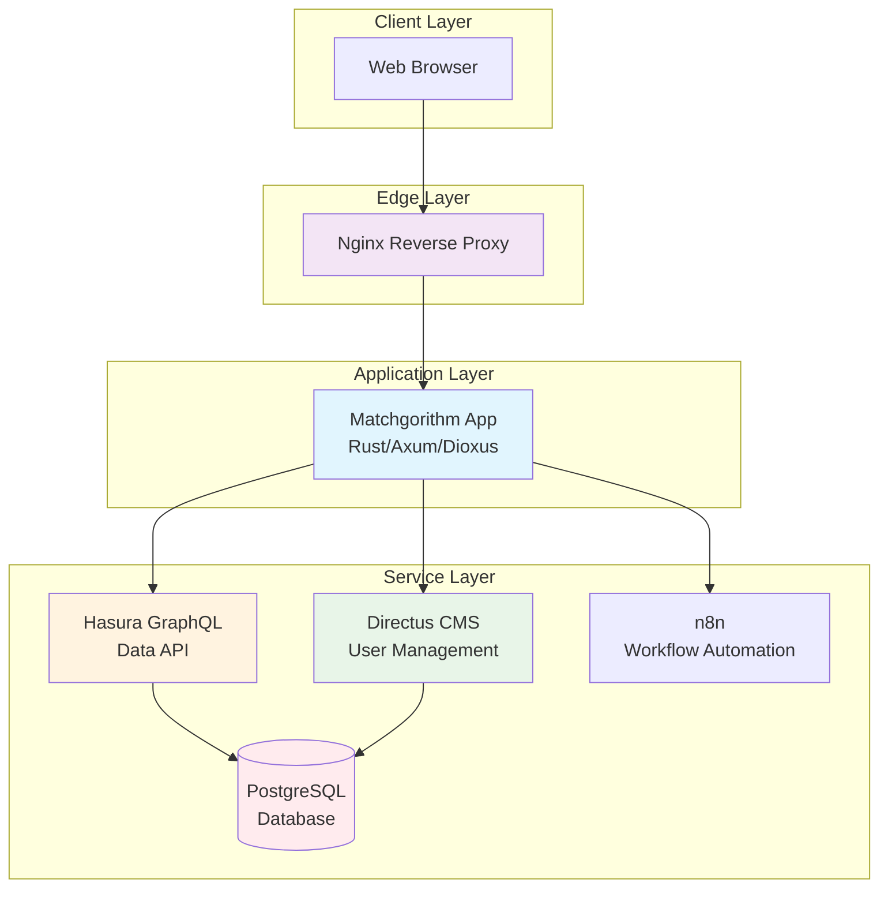
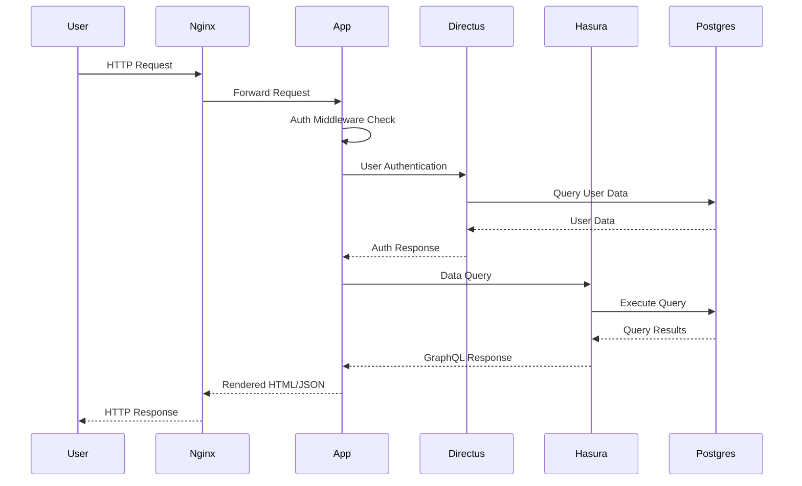
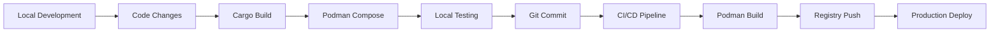

# Architecture Overview

## System Architecture

Matchgorithm is a modern web application built with Rust, providing an AI-powered matching platform with evolutionary algorithms. The system follows a microservices architecture deployed using Podman containers.



## Component Architecture

### Frontend (Dioxus)
- **Framework**: Dioxus - Rust-based reactive web framework
- **Rendering**: Server-Side Rendering (SSR) with hydration
- **Routing**: Client-side routing with Dioxus Router
- **Styling**: Tailwind CSS classes
- **State Management**: Component-level state with signals

### Backend (Axum)
- **Framework**: Axum - ergonomic web framework for Rust
- **Async Runtime**: Tokio
- **Middleware**: CORS, compression, authentication
- **API**: REST endpoints with JSON responses
- **GraphQL Proxy**: Forward GraphQL requests to Hasura

### Authentication System
- **JWT**: RS256 asymmetric encryption
- **User Store**: Directus CMS
- **Middleware**: Axum-based token validation
- **Session**: Stateless JWT tokens

### Data Layer
- **Database**: PostgreSQL with SQLx
- **ORM**: SQLx for type-safe queries
- **GraphQL**: Hasura for real-time data access
- **CMS**: Directus for content and user management

## Data Flow



## Security Architecture

- **Transport**: HTTPS with SSL/TLS termination at Nginx
- **Authentication**: JWT tokens with RSA signing
- **Authorization**: Role-based access control via Directus
- **Secrets**: Podman secrets with file-based injection
- **Headers**: Security headers (CSP, HSTS, X-Frame-Options)
- **Input Validation**: Serde-based request validation

## Deployment Architecture

- **Container Runtime**: Podman
- **Orchestration**: podman-compose
- **Reverse Proxy**: Nginx with load balancing
- **Health Checks**: Container and service-level monitoring
- **Secrets Management**: External Podman secrets
- **Logging**: Structured logging with tracing

## Component Relationships

| Component | Responsibility | Dependencies |
|-----------|----------------|--------------|
| Dioxus Frontend | UI rendering and interaction | Axum (SSR), Tailwind CSS |
| Axum Backend | HTTP server, routing, middleware | Dioxus, Services |
| Auth Service | JWT token management | Directus API, RSA keys |
| Directus Client | CMS operations | Directus API |
| Hasura Client | GraphQL proxy | Hasura API |
| Database Service | Connection pooling | PostgreSQL |
| Auth Middleware | Request authentication | JWT Service |

## Performance Considerations

- **SSR**: Server-side rendering for fast initial page loads
- **Compression**: Gzip compression at Nginx level
- **Caching**: Browser caching for static assets
- **Connection Pooling**: SQLx connection pool for database
- **Async**: Tokio async runtime for concurrent requests
- **Health Checks**: Automated monitoring and restart policies

## Scalability

- **Horizontal Scaling**: Stateless design allows multiple app instances
- **Database Scaling**: PostgreSQL read replicas support
- **Caching Layer**: Redis can be added for session/data caching
- **Load Balancing**: Nginx handles request distribution
- **Microservices**: Modular design enables service scaling

## Development Workflow



This architecture provides a robust, scalable foundation for the AI-powered matching platform while maintaining developer productivity and operational reliability.
┌─────────────────────────────────────────────────────────────┐
│                         Nginx (Reverse Proxy)                │
│                     SSL Termination & Load Balancing         │
└────────────┬─────────────────────────────────────────────────┘
             │
   ┌─────────┴──────────┬───────────────┬─────────────────────┐
   │                    │               │                     │
   ▼                    ▼               ▼                     ▼
┌─────────┐      ┌──────────┐   ┌────────────┐      ┌─────────────┐
│ Dioxus  │      │ Directus │   │   Hasura   │      │     n8n     │
│   SSR   │◄────►│   CMS    │   │  GraphQL   │      │  Workflows  │
│  (Axum) │      │   API    │   │    API     │      │    Engine   │
└────┬────┘      └─────┬────┘   └─────┬──────┘      └──────┬──────┘
     │                 │              │                     │
     └─────────────────┴──────────────┴─────────────────────┘
                                │
                                ▼
                      ┌──────────────────┐
                      │  PostgreSQL 13   │
                      │  (Source of Truth)│
                      └──────────────────┘
```

## Component Responsibilities

### 1. Dioxus Frontend (Rust)

**Technology**: Dioxus 0.6 with SSR, Axum server  
**Port**: 8080  
**Role**: UI rendering and client-side interactivity

**Responsibilities:**
- Server-side rendering of all pages
- Reactive UI components
- Form validation and submission
- WebSocket connections for real-time updates
- OAuth authentication flows
- Session management via JWT

**Key Files:**
- `src/main.rs` - Axum server setup
- `src/pages/` - Page components
- `src/components/` - Reusable UI components

### 2. Directus CMS

**Technology**: Directus (Node.js)  
**Port**: 8055  
**Role**: Headless CMS and admin interface

**Responsibilities:**
- Content management (blog posts, careers, solutions)
- User profile storage
- File uploads and media management
- Admin dashboard
- REST API for content delivery
- Role-based access control (RBAC)

**API Endpoints:**
- `GET /items/posts` - Fetch blog posts
- `POST /items/users` - Create user profiles
- `GET /files/:id` - Retrieve uploaded files

### 3. Hasura GraphQL Engine

**Technology**: Hasura  
**Port**: 8080  
**Role**: Real-time GraphQL API

**Responsibilities:**
- GraphQL queries and mutations
- Real-time subscriptions (WebSocket)
- Data aggregations and joins
- Permission rules
- Event triggers

**Schema:**
- `users` - User accounts and profiles
- `matches` - Matching results
- `analytics` - Platform metrics
- `workflows` - Automation execution logs

### 4. n8n Workflow Automation

**Technology**: n8n  
**Port**: 5678  
**Role**: Marketing automation and data pipelines

**Responsibilities:**
- Email campaign triggers
- Lead scoring automation
- Webhook processing
- Third-party integrations (Hunter.io, Apollo.io)
- Analytics data aggregation

**Workflows:**
- User onboarding email sequence
- Weekly match digest
- Lead qualification pipeline
- Analytics export scheduler

### 5. PostgreSQL Database

**Technology**: PostgreSQL 13  
**Port**: 5432  
**Role**: Single source of truth

**Responsibilities:**
- All application data storage
- Session state
- Full-text search
- Transactional consistency
- Point-in-time recovery (PITR)

**Schema Management:**  
Managed through Directus migrations. No manual SQL required.

### 6. Nginx Reverse Proxy

**Technology**: Nginx  
**Ports**: 80 (HTTP), 443 (HTTPS)  
**Role**: Traffic routing and SSL termination

**Routing Rules:**
- `/` → Dioxus app (8080)
- `/api/cms/*` → Directus (8055)
- `/api/graphql` → Hasura (8080)
- `/api/workflows/*` → n8n (5678)

**Features:**
- Gzip compression
- Rate limiting
- CORS headers
- Security headers (HSTS, CSP)
- SSL/TLS termination

## Data Flow

### User Registration Flow

```
User → Dioxus Form → Axum Handler → Directus API → Postgres
                                    ↓
                              n8n Webhook (welcome email)
```

### Matching Algorithm Flow

```
User Profile → Hasura GraphQL → Evolutionary Algorithm (Rust)
                               ↓
                         Match Candidates
                               ↓
                         Store in Postgres → Real-time Subscription Update
```

### Content Delivery Flow

```
Request → Nginx → Dioxus SSR → Directus REST API → Postgres → Response
```

## Authentication

**Method**: JWT (JSON Web Tokens) stored in HTTP-only cookies

**Flow:**
1. User logs in via OAuth (Google/GitHub/Apple)
2. Axum server exchanges OAuth code for user info
3. Server creates user record in Directus
4. Server generates JWT with user ID and roles
5. JWT stored in secure, HTTP-only cookie
6. Subsequent requests include JWT for authorization

**Token Structure:**
```rust
struct Claims {
    sub: String,        // User ID
    exp: i64,           // Expiration timestamp
    roles: Vec<String>, // User roles (user, admin)
}
