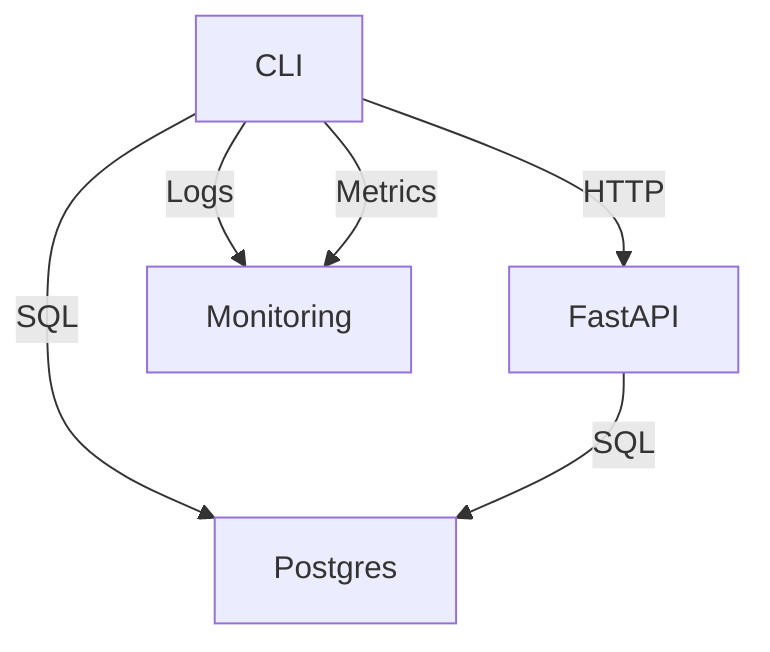

# Matchgorithm CLI Architecture

## Purpose
The **official** Matchgorithm CLI (`matchgorithm-cli/`) provides:
- **Deterministic management** of hybrid kNN services
- **FastAPI service integration** for orchestration
- **UK-compliant operations** with proper logging
- **Security audits** and compliance checks

## Design Principles
1. **Single Responsibility**: Each command does one thing well
2. **UK Compliance**: All operations respect UK data residency
3. **Security First**: No direct database access from CLI
4. **FastAPI Integration**: All database operations go through FastAPI
5. **Deterministic**: All operations are reproducible and auditable

## Component Diagram


## Command Structure
```
matchgorithm-cli/
├── src/
│   ├── commands/   # Command implementations
│   ├── core/       # Shared functionality
│   └── utils/      # Utilities
├── tests/         # Test suites
└── docs/          # Documentation
```

## Security Model
- **No direct DB access**: All database operations go through FastAPI
- **JWT authentication**: All FastAPI calls are authenticated
- **Input validation**: All commands validate inputs
- **UK timezone**: All logs/timestamps use Europe/London
- **Rate limiting**: CLI respects FastAPI rate limits

## UK-Specific Considerations
- All data operations comply with UK GDPR
- Timezone-aware logging (Europe/London)
- Data residency verified for all operations
- ICO registration number included in logs

## Integration Points
- **FastAPI Service**: All business logic operations
- **Postgres Database**: Data persistence via FastAPI
- **Podman**: Container management
- **Prometheus**: Metrics collection
- **UK Infrastructure**: Region-specific deployments

## Error Handling
- **Custom error types**: `CliError` enum for different error categories
- **UK-compliant logging**: Structured logging with compliance metadata
- **Graceful degradation**: Commands fail safely without data loss
- **Audit trails**: All operations logged with timestamps and user context

## Performance
- **Async operations**: All I/O operations are asynchronous
- **Streaming responses**: Large data transfers use streaming
- **Connection pooling**: Efficient database connections
- **Caching**: Response caching for repeated operations

## Testing
- **Unit tests**: Individual function testing
- **Integration tests**: FastAPI service integration
- **Security tests**: Automated vulnerability scanning
- **UK compliance tests**: Automated compliance verification